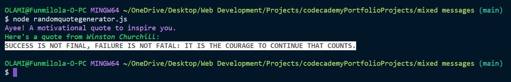

# Random Quote Generator  
***
This is a random quote generator program.  

## Table of Contents  
***  

  - [General Info](#general-info)
  - [Technologies](#technologies)
  - [Setup](#setup)
  - [Inspiration](#inspiration)

## General Info  

This project is a random quote generator, everything the program is run, a new randomly generated quote is displayed on the console.  


## Technologies  

The technologies used in creating the project are:  

- colors version: 1.4
- nodejs
- npm

## Setup  

To run this project, _make sure you have [node](https://nodejs.org/en/download/) installed_, download the project zipped file [here](https://github.com/funmilolajire/randomquotegenerator/archive/main.zip) and unzip:

```ssh
$ cd ../randomquotegenerator
$ npm install
$ node randomquotegenerator.js
```  

## Inspiration  

This project is based on a [codecademy](https://www.codecademy.com/learn) portfolio project on the fullstack engineer path.  
